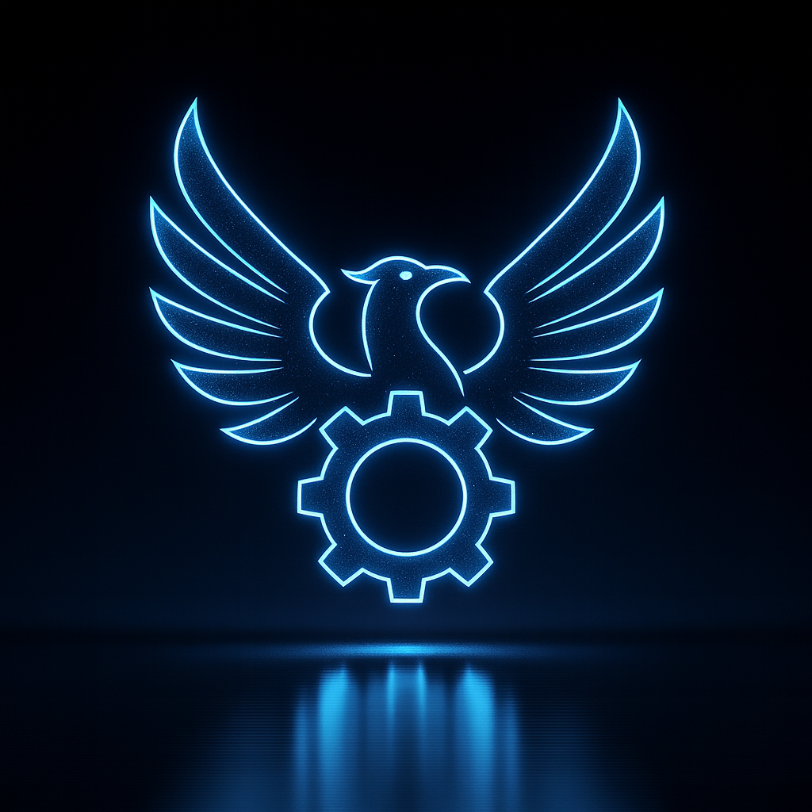

# Nomous

<div align="center">
  
  <br>
  <strong>A Local Autonomy Runtime Bridge</strong>
</div>

## Overview
Nomous is an offline-first WebSocket bridge that connects a TypeScript React dashboard to local AI services. The runtime wires together:
- 🧠 **Local LLM** loading via `llama.cpp`, including live load progress reporting and runtime sampling controls【F:src/backend/llm.py†L21-L115】【F:src/frontend/App.tsx†L330-L401】
- 🎤 **Speech-to-Text** streaming from the browser microphone to Vosk with configurable sensitivity and automatic LLM triggering【F:src/backend/audio.py†L15-L118】【F:scripts/run_bridge.py†L108-L158】
- 🗣️ **Text-to-Speech** synthesis through Piper with runtime toggles, voice switching, and optional auto playback【F:src/backend/tts.py†L15-L138】【F:scripts/run_bridge.py†L72-L157】
- 👁️ **Computer Vision** capture with MediaPipe gesture detection, motion-aware frame streaming, and autonomous vision prompts for the LLM【F:src/backend/video.py†L1-L176】【F:src/backend/video.py†L360-L437】
- 📈 **System telemetry** that surfaces CPU/GPU utilisation and memory pressure inside the dashboard UI【F:src/backend/system.py†L1-L152】【F:src/frontend/components/SystemUsageCard.tsx†L1-L83】
- 📚 **Persistent memory graph & tool system** that lets the model store observations, run self-evaluations, and surface tool activity in the UI【F:src/backend/memory.py†L1-L170】【F:src/backend/tools.py†L1-L146】【F:src/frontend/App.tsx†L376-L430】

## Feature Highlights
- ✨ Real-time token streaming, load overlays, and chat playback for every assistant response【F:src/backend/llm.py†L116-L212】【F:src/frontend/App.tsx†L330-L401】
- 🛠️ **Nine built-in LLM tools** covering memory search, observation logging, learning, and social safeguards with UI visualisation of tool usage and stats【F:src/backend/tools.py†L32-L187】【F:src/frontend/components/ToolActivity.tsx†L6-L213】
- 📹 Live camera preview with motion thresholds, gesture detection, and configurable debounce/cooldown windows【F:src/backend/video.py†L28-L123】【F:src/backend/video.py†L360-L437】
- 🎙️ Browser microphone streaming (PCM16) with automatic speech detection and configurable sensitivity【F:src/backend/audio.py†L33-L118】
- 🔊 Optional Piper TTS synthesis with per-session toggles for enablement, auto playback, volume, and voice selection【F:src/backend/tts.py†L19-L138】【F:scripts/run_bridge.py†L72-L154】
- 🧠 Persistent memory graph with SQLite backing plus front-end visualisation and analytics helpers【F:src/backend/memory.py†L13-L167】【F:src/frontend/App.tsx†L403-L430】
- 📊 Dashboard telemetry (system metrics, behaviour scoring, reward accounting, token throughput) surfaced through dedicated cards and charts【F:src/backend/handlers.py†L24-L43】【F:src/frontend/components/SystemUsageCard.tsx†L1-L83】【F:src/frontend/App.tsx†L1614-L2158】

## Feature Status
### ✅ Complete & Working
- Local llama.cpp LLM loading with progress events, sampling controls, and autonomous thought/vision loops【F:src/backend/llm.py†L21-L212】【F:scripts/run_bridge.py†L108-L213】
- Vosk-based microphone pipeline that feeds transcripted speech into the LLM and echoes microphone activity back to the UI【F:src/backend/audio.py†L33-L118】【F:src/frontend/App.tsx†L330-L383】
- MediaPipe-enabled camera loop with motion gating, gesture detection, and asynchronous vision prompts for the model【F:src/backend/video.py†L28-L123】【F:src/backend/video.py†L360-L437】
- Tool execution framework with nine tools, execution history, and dedicated dashboard widgets【F:src/backend/tools.py†L32-L187】【F:src/frontend/components/ToolActivity.tsx†L6-L213】
- System telemetry publishing CPU/GPU metrics and surfacing device context in the UI system usage card【F:src/backend/system.py†L1-L152】【F:src/frontend/components/SystemUsageCard.tsx†L1-L83】
- Persistent memory store that records interactions and streams the graph to the UI via WebSocket events【F:src/backend/memory.py†L13-L167】【F:src/frontend/App.tsx†L403-L430】

### ⚠️ Work in Progress / Limited Support
- Piper auto-playback relies on a Windows PowerShell media player shim; audio playback must be replaced for Linux/macOS deployments even though synthesis still works【F:src/backend/tts.py†L87-L123】
- GPU metrics require `torch`, `pynvml`, and `psutil`; missing dependencies will disable telemetry and cause the Python test suite to fail when system monitoring tests import them【F:src/backend/system.py†L1-L152】【F:tests/test_system.py†L1-L120】【62a53a†L1-L36】
- Automated tooling around pytest async marks needs configuration – warnings appear until a custom `asyncio` marker is registered in `pytest.ini`【F:tests/test_tools.py†L80-L328】【62a53a†L11-L36】

### 🚧 Not Yet Implemented / Planned
- Additional gesture classifiers (thumbs down, fists, etc.) and configurable gesture-to-action mappings noted in the roadmap【F:docs/CHANGELOG.md†L136-L170】
- Custom wake-word activation for hands-free microphone capture【F:docs/CHANGELOG.md†L168-L170】
- Cross-platform audio playback backend for Piper-generated speech so Linux/macOS users receive spoken feedback without external tools【F:src/backend/tts.py†L87-L123】

## Quick Start

### One-command bootstrap
Run the launcher to automatically create a virtual environment, install Python
and Node dependencies, validate required tooling, and start both the backend and
frontend services:

```bash
python run_nomous.py
# Legacy invocation supported for convenience
python start.py
```

If any prerequisite is missing or a step fails, the launcher prints a detailed
message explaining what happened and how to resolve it.

### Manual setup
1. Clone the repository
```bash
git clone https://github.com/ant3869/nomous.git
cd nomous
```

2. Install dependencies
```bash
# Backend
pip install -r requirements.txt

# Frontend
npm install
```

3. Configure `config.yaml` with your model paths and settings

4. Start the full bridge (backend workers + React dev server)
```bash
python scripts/start.py
```

To run only the backend bridge without launching the UI dev server:
```bash
python scripts/run_bridge.py
```

## Project Structure
```
nomous/
├─ src/
│  ├─ backend/         # Python WebSocket server
│  │  ├─ audio.py     # Audio processing
│  │  ├─ video.py     # Video capture
│  │  ├─ llm.py       # LLM integration
│  │  └─ tts.py       # Text-to-speech
│  │
│  └─ frontend/       # React TypeScript UI
│     ├─ components/  # UI components
│     └─ App.tsx      # Main application
│
├─ scripts/           # Utility scripts
├─ tests/            # Test suite
└─ config.yaml       # Configuration
```

## Configuration
Key configuration sections in `config.yaml`:

```yaml
paths:
  gguf_path: path/to/model.gguf
  embed_gguf_path: models/embed/bge-small-en-v1.5-f16.gguf
  vosk_model_dir: path/to/vosk-model
  piper_exe: path/to/piper.exe
  piper_voice: path/to/voice.onnx
  piper_out_dir: path/to/output

llm:
  enable: true
  n_ctx: 2048
  n_threads: 4
  temperature: 0.6
  top_p: 0.95
```

See [INSTALL_INSTRUCTIONS.md](docs/INSTALL_INSTRUCTIONS.md) for detailed setup steps.

### Optional Components
- **GPU acceleration** – enable by setting `llm.n_gpu_layers` and installing CUDA-enabled `llama-cpp-python`; telemetry additionally needs `torch` + `pynvml` (see `requirements.txt`).【F:src/backend/llm.py†L89-L115】【F:src/backend/system.py†L1-L152】
- **Piper text-to-speech** – requires `paths.piper_exe`, `paths.piper_voice`, and `paths.piper_out_dir` to exist; auto playback currently targets Windows PowerShell.【F:src/backend/tts.py†L29-L138】
- **Vision analysis & gestures** – ensure OpenCV can access your camera and install `mediapipe` for gesture detection.【F:src/backend/video.py†L15-L68】

## Testing
Run the test suite:
```bash
python -m pytest tests/
```

## Documentation
- [Installation Guide](docs/INSTALL_INSTRUCTIONS.md)
- [Frontend Documentation](docs/README_FE.md)
- [LLM Tool System](docs/TOOLS.md)
- [Implementation Summary](docs/IMPLEMENTATION_SUMMARY.md)
- [Changelog](docs/CHANGELOG.md)
- [Bug Fixes](docs/BUG_FIXES.md)
- [Testing Guide](docs/TESTING.md)

## GitHub Copilot Collections
The following Copilot collections are installed to enhance development:

### Python Development & ML Collection
- 📝 **Instructions**: GPU optimization, ML model integration, async patterns
- 🎯 **Prompts**: GPU optimization guide
- 💭 **Chat Mode**: Python ML expert for guidance

### Frontend Web Development Collection
- 📝 **Instructions**: React, TypeScript, WebSocket best practices
- 🎯 **Prompts**: React component generator
- 💭 **Chat Mode**: Frontend expert for assistance

### Testing & Test Automation Collection
- 📝 **Instructions**: WebSocket and ML model testing patterns
- 🎯 **Prompts**: Test suite generator
- 💭 **Chat Mode**: Testing expert for guidance

### Security & Code Quality Collection
- 📝 **Instructions**: Security best practices and code quality
- 🎯 **Prompts**: Code quality enhancer
- 💭 **Chat Mode**: Security & quality expert

The collections are located in `.github/copilot/` and include:
```
.github/copilot/
├─ instructions/    # Best practices and guidelines
├─ prompts/        # Task-specific generators
└─ chatmodes/      # Expert chat modes
```

## Technical Stack
- **Backend**: Python, asyncio, websockets, OpenCV, Vosk, Piper
- **Frontend**: React 18+, TypeScript, Tailwind CSS, shadcn/ui
- **ML**: llama.cpp, GGUF models, BGE embeddings
- **Build**: Vite, PostCSS

## License
MIT License - See [LICENSE](LICENSE) for details